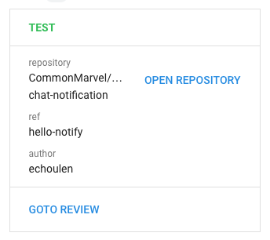
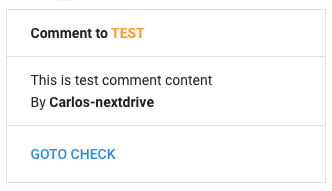
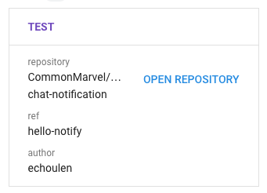

# Google Chat Notification Action
This is a fork of [CommonMarvel/google-chat-notification](https://github.com/CommonMarvel/google-chat-notification), heavily modified for our use cases.

[](https://github.com/associate-run-projects/google-chat-notification/actions/workflows/test.yml)





### Usage

Add `notify.yml` to `.github/workflows/`

> .github/workflows/notify.yml
```yaml
name: notify
on:
  pull_request:
    types: [opened, reopened, closed]
  pull_request_review_comment:
    types: [created]
jobs:
  notify:
    runs-on: ubuntu-latest
    steps:
    - name: Google Chat Notification
      uses: associate-run-projects/google-chat-notificationn@master
      with:
        url: ${{ secrets.GOOGLE_CHAT_WEBHOOK }}
```
